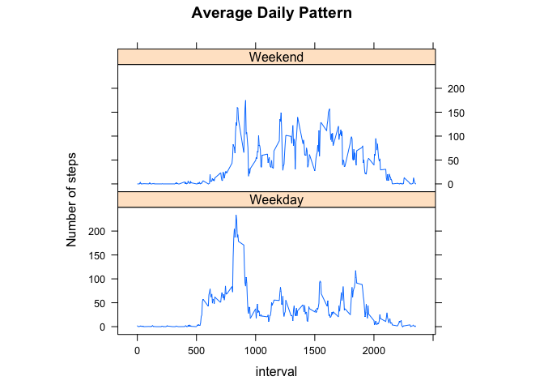

# Reproducible Research: Peer Assessment 1


## Loading and preprocessing the data


```r
# Use setwd() to change the working directory to where activity.csv has been extracted from activity.zip.

activity <- read.csv( "activity.csv" )
```

## What is mean total number of steps taken per day?


```r
# create a subset free of missing data
activity_sans_na <- subset( activity, ! is.na (steps) )

# group the steps by date
total_steps_by_date <- aggregate( steps ~ date, activity_sans_na, sum )
names( total_steps_by_date ) <- c( "date", "total_steps" )

head( total_steps_by_date, n = 5 )
```

```
##         date total_steps
## 1 2012-10-02         126
## 2 2012-10-03       11352
## 3 2012-10-04       12116
## 4 2012-10-05       13294
## 5 2012-10-06       15420
```

```r
tail( total_steps_by_date, n = 5 )
```

```
##          date total_steps
## 49 2012-11-25       11834
## 50 2012-11-26       11162
## 51 2012-11-27       13646
## 52 2012-11-28       10183
## 53 2012-11-29        7047
```


```r
# plot the result
hist( total_steps_by_date$total_steps, xlab = "", main = "Total Steps Per Day" )
```

 

```r
# mean of total number of steps taken per day
mean( total_steps_by_date$total_steps )
```

```
## [1] 10766.19
```

```r
# median of total number of steps taken per day
median( total_steps_by_date$total_steps )
```

```
## [1] 10765
```

## What is the average daily activity pattern?


```r
# Calculate the averages
average_steps_every_5_minutes <- aggregate( steps ~ interval, activity_sans_na, mean )

# Plot the result
plot( type = "l", average_steps_every_5_minutes, xlab = "24 Hours in 5-minute Interval", ylab = "Average Steps Taken", main = "Average Daily Activities" )
```

 

```r
# Find the interval that has the maximum number of steps
average_steps_every_5_minutes [ average_steps_every_5_minutes$steps == max( average_steps_every_5_minutes$steps), ]
```

```
##     interval    steps
## 104      835 206.1698
```

It appears 08:35am is the most active interval during the day.

## Inputing missing values

Analyze the original dataset for missing data.


```r
summary( activity )
```

```
##      steps                date          interval     
##  Min.   :  0.00   2012-10-01:  288   Min.   :   0.0  
##  1st Qu.:  0.00   2012-10-02:  288   1st Qu.: 588.8  
##  Median :  0.00   2012-10-03:  288   Median :1177.5  
##  Mean   : 37.38   2012-10-04:  288   Mean   :1177.5  
##  3rd Qu.: 12.00   2012-10-05:  288   3rd Qu.:1766.2  
##  Max.   :806.00   2012-10-06:  288   Max.   :2355.0  
##  NA's   :2304     (Other)   :15840
```

```r
summary( activity$steps )
```

```
##    Min. 1st Qu.  Median    Mean 3rd Qu.    Max.    NA's 
##    0.00    0.00    0.00   37.38   12.00  806.00    2304
```
It looks like only the steps column contains missing values and there are 2304 observations/rows with NA.

Here's a sample of these observations:

```r
activity_with_na <- subset( activity, is.na (steps) )

head( activity_with_na )
```

```
##   steps       date interval
## 1    NA 2012-10-01        0
## 2    NA 2012-10-01        5
## 3    NA 2012-10-01       10
## 4    NA 2012-10-01       15
## 5    NA 2012-10-01       20
## 6    NA 2012-10-01       25
```

```r
tail( activity_with_na )
```

```
##       steps       date interval
## 17563    NA 2012-11-30     2330
## 17564    NA 2012-11-30     2335
## 17565    NA 2012-11-30     2340
## 17566    NA 2012-11-30     2345
## 17567    NA 2012-11-30     2350
## 17568    NA 2012-11-30     2355
```

The strategy for filling missing values is to use the mean (average steps) for the corresponding interval.


```r
activity_na_replaced <- transform( activity, steps = ifelse( is.na (steps), average_steps_every_5_minutes[ average_steps_every_5_minutes$interval == interval, ]$steps, steps) )
```

Here is the histogram of this new version:

```r
# group the steps by date
total_steps_by_date <- aggregate( steps ~ date, activity_na_replaced, sum )
names( total_steps_by_date ) <- c( "date", "total_steps" )

# plot the result
hist( total_steps_by_date$total_steps, xlab = "", main = "Total Steps Per Day (NAs replaced)" )
```

 

```r
# mean of total number of steps taken per day
mean( total_steps_by_date$total_steps )
```

```
## [1] 10766.19
```

```r
# median of total number of steps taken per day
median( total_steps_by_date$total_steps )
```

```
## [1] 10765.59
```


## Are there differences in activity patterns between weekdays and weekends?

```r
activity_na_replaced$day <- weekdays( as.Date (activity_na_replaced$date) )

week_days <- c ("Monday", "Tuesday", "Wednesday", "Thursday", "Friday")

activity_na_replaced[ ! activity_na_replaced$day %in% week_days, "day"] <- "Weekend" 
activity_na_replaced[ activity_na_replaced$day %in% week_days, "day"] <- "Weekday" 

activity_na_replaced$day <- as.factor( activity_na_replaced$day )

summary( activity_na_replaced$day )
```

```
## Weekday Weekend 
##   12960    4608
```

```r
#head ( activity_na_replaced )
```

Here is the plot comparing the steps of weekdays and those on the weekends:

```r
activity_na_replaced_compare <- aggregate( activity_na_replaced$steps ~ activity_na_replaced$interval + activity_na_replaced$day, activity_na_replaced, mean )

names( activity_na_replaced_compare ) <- c("interval", "is_weekend", "average_steps")

# plot it
library( lattice )
par( mfrow = c(2,1) )

xyplot( average_steps ~ interval | is_weekend, data = activity_na_replaced_compare, type = "l", aspect = 2/5, ylab = "Number of steps", main = "Average Daily Pattern" )
```

 
